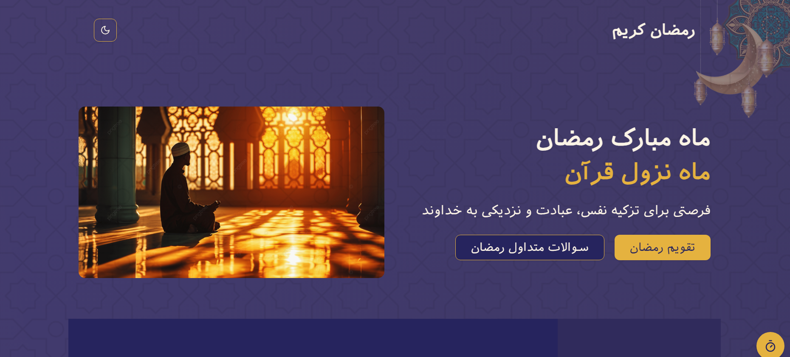

# رمضان | Ramadan Website

A modern, elegant website providing essential information about Ramadan, including prayers, Surahs, and Islamic teachings.

## Features

- 📖 Essential Information about Ramadan
- 🕌 Daily Prayers and Duas
- 📿 Quranic Surahs with Audio
- 🌙 Prayer Times Widget
- ❓ Comprehensive FAQ Section
- 📚 Authentic Islamic Sources

## Screenshots




## Live Demo
Check out the live demo [here](https://ramadan-b6sy.vercel.app/).

## Tech Stack

- React Js
- TypeScript
- Tailwind CSS
- Shadcn UI
- Lucide Icons

## Getting Started

1. Clone the repository:

```bash
git clone https://github.com/username/ramadan.git
```

2. Install dependencies:

```bash
npm install
```

3. Run the development server:

```bash
npm run dev
```

## Credits

- Quran translations: [Parsquran](http://www.parsquran.com/)
- Prayer times: [Islamic Finder](https://www.islamicfinder.org/)
- FAQ content: [California Islamic Center](http://www.calislamic.com/)
